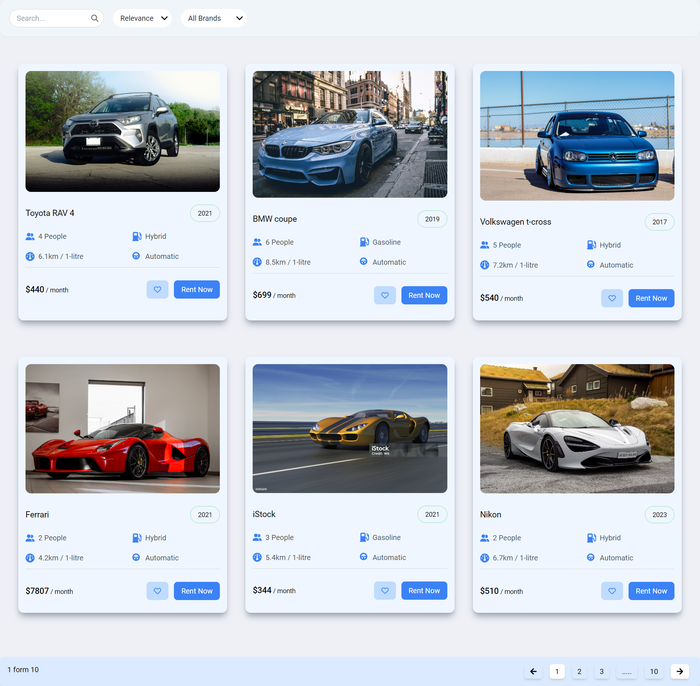

# Seller App

This project is a car search website created using React.js and Tailwind CSS. The website displays car cards in a grid layout and allows users to search for cars based on their names and paginate through the results.

## Table of Contents

- [Features](#features)
- [Technologies Used](#technologies-used)
- [Installation](#installation)

## Features

- **Car Search:** Users can search for cars by name
- **Pagination:** The results are paginated, with a maximum of 6 car cards displayed per page and includes functional next and previous buttons
- **URL-based Pagination:** The URL changes according to the page number

## Technologies Used

- **React.js**: In this project, React is used to build the entire frontend, create reusable UI components and manage the state of application efficiently including the search functionality, pagination, and car cards
- **Tailwind CSS**: To style the components and layout the car cards in a grid format
- **Context API**: State management across the entire application

## Installation

### Prerequisites

- Node

### Steps

1. **Clone the repository**:
    ```bash
    git clone https://github.com/shwet20/seller-app.git 
    cd seller-app
    ```
2. **Install dependencies**:
    ```bash
    npm install
    ```
3. **Install and configure Tailwind CSS**

4. **Run the project**:
    ```bash
    npm start
    ```

## Screenshot

